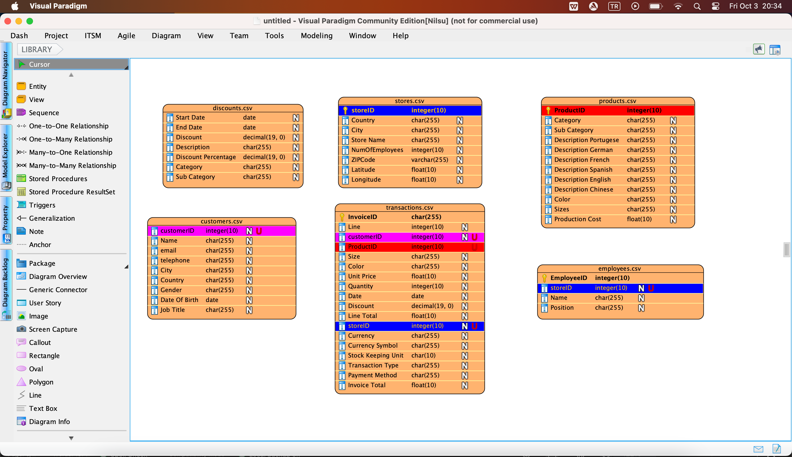
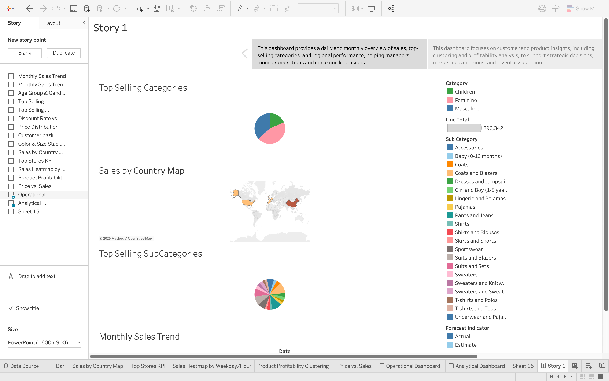
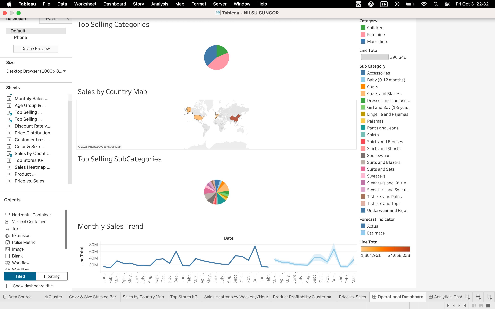

# Business Data Analysis with Tableau

## Project Overview
This project explores the Global Fashion Retail Sales dataset to uncover **data-driven insights** using Tableau.  
The analysis includes **time-series trends, customer segmentation, geographical analysis**, and advanced techniques like **regression** and **clustering**.  
The final report is designed to simulate communication with a **business audience** — clear, insight-driven, and visually engaging.

---

## 📂 Repository Structure
- project-folder/

    - tableau/ # Tableau workbooks (.twb/.twbx) and exported dashboards
    - report/ # Final written report
    - README.md # Project documentation

---

## 📊 Dataset

The dataset used in this project comes from Kaggle:

👉 [Global Fashion Retail Stores Dataset](https://www.kaggle.com/datasets/ricgomes/global-fashion-retail-stores-dataset)

This dataset contains detailed information about customers, products, transactions, and store performance for a global fashion retail chain.

---

## 📊 Key Features 
- **Visualization in Tableau:** interactive dashboards, advanced chart types  
- **Analytical Techniques:**  
  - Regression for trend analysis
  - Clustering for customer segmentation
- **Business Communication:** final report focuses on insights and recommendations  

---

## 📑 Report
📄 The final report is available in the [`report/`](./report) folder.  
It summarizes the main findings and presents recommendations for a business audience.

---

## 🔧 How to Use
1. Clone the repository:
   ```bash
   git clone https://github.com/nilsugungor/global-fashion-retail-sales-tableau-assignment.git global-fashion-sales
   cd global-fashion-sales
2. Open Tableau files from the tableau/ folder.
3. 
4. 
5. 

